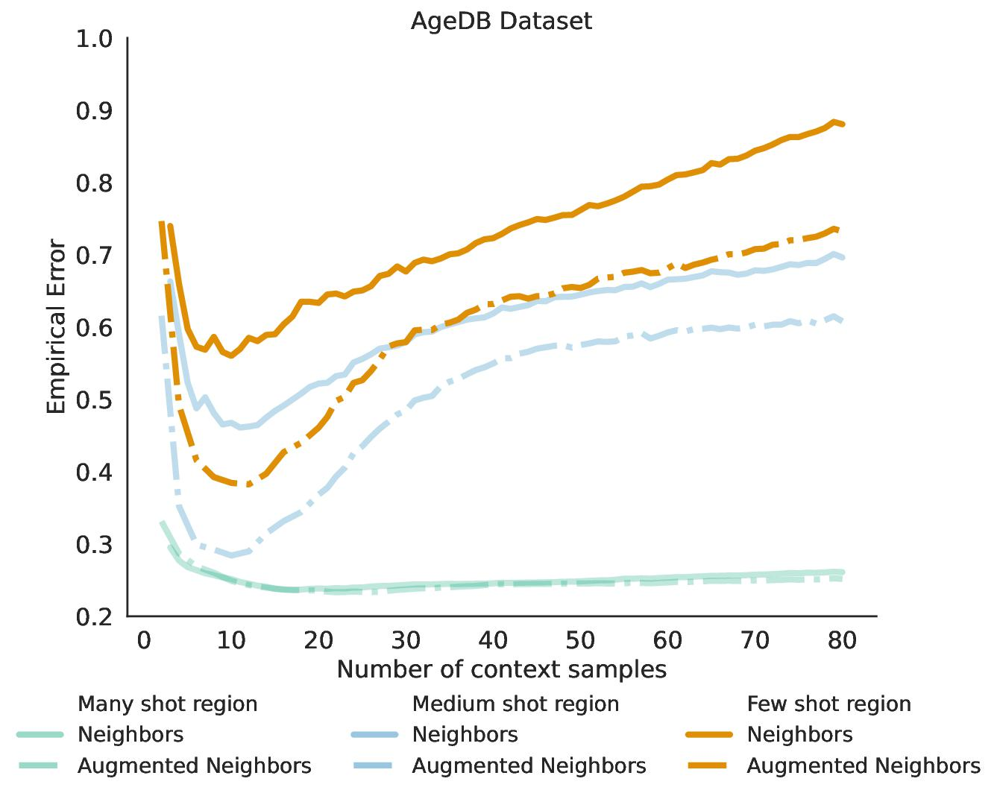

# IM-Context
[TMLR 2024] Code for our paper "IM-Context: In-Context Learning for Imbalanced Regression Tasks"

Paper: https://openreview.net/forum?id=p4Y844vJWG



## Overview
IM-Context introduces a novel approach for handling imbalanced regression tasks through in-context learning. Our method leverages large language models to improve prediction accuracy in tail regions (where few data points exist) while maintaining performance in majority regions (where many data points exist).

Figure 1 demonstrates a critical observation in imbalanced regression using the AgeDB dataset: as we increase the context size (k), samples in the majority region show continuously decreasing error. However, for samples in the tail regions, we observe a distinctive U-shaped error curve. This suggests that minority samples benefit most from a smaller, carefully curated set of context examples, while larger contexts may introduce noise from dissimilar samples. This empirical finding motivates our adaptive context selection strategy, which optimizes the context size based on the sample's location in the data distribution.

## Prerequisites
- Python3
- Numpy
- PyTorch
- Transformers
- PIL
- scikit-learn

Please create and activate the following conda environment:
```python
# It may take several minutes for conda to solve the environment
conda update conda
conda env create -f environment.yml
conda activate in-context-learning
```

## Run benchmarking experiments
```bash
jupyter notebook code/Benchmark_all_tabular.ipynb
```

For the GPT2 model, please download it from this repository: https://github.com/dtsip/in-context-learning?tab=readme-ov-file

## Project Structure
IM-Context

├── code\
│   └── Benchmark_all_tabular.ipynb\
├── models\
│   └── gpt2\
├── data\
│   └── tabular\
├── environment.yml\
└── README.md

## Acknowledgements
Thanks to the TMLR reviewers for their valuable feedback


## Contact
For questions regarding the code or paper, please contact: Ismail Nejjar (ismail.nejjar@epfl.ch)

## Citation
@article{nejjar2024imcontext,\
  title={IM-Context: In-Context Learning for Imbalanced Regression Tasks},\
  author={Nejjar, Ismail and Ahmed, Faez and Fink, Olga},\
  journal={Transactions on Machine Learning Research},\
  year={2024}
}

